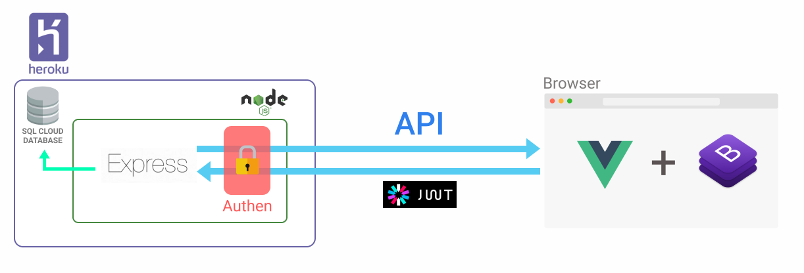

# Inventory Project

## Must know
- **Git**
   - [Git คืออะไร ? + พร้อมสอนใช้งาน Git และ Github](https://devahoy.com/posts/introduction-to-git-and-github/)
   - [เรียนรู้ Git และ Github ฉบับเด็กมหาลัย](https://medium.com/@thanatchakromsang/เรียนรู้-git-และ-github-ฉบับเด็กมหาลัย-7311034c6527)
   
- **Nodejs**
   - [JavaScript Introduction](https://www.w3schools.com/js/js_intro.asp)
   - [Node.js คืออะไร ? + เริ่มต้นใช้งาน Node.js](https://devahoy.com/posts/getting-started-with-nodejs/)
 
- **Api**
   - [RESTful คืออะไร REST คือ การสื่อสารแลกเปลี่ยนข้อมูลผ่าน webservice](https://saixiii.com/what-is-restful/)
   - [แนวออกแบบ RESTful API — วิธีปฏิบัติที่ดี](https://medium.com/@phayao/แนวออกแบบ-restful-api-วิธีปฏิบัตที่ดี-c320d806e30b)

- **Stateless - Statefull & JWT**
   - [JSON Web Token มาตรฐานใหม่ ในการทำ Authentication](https://medium.com/rootusercc/json-web-token-มาตรฐานใหม่-ในการทำ-authentication-b0760dd9acd1)
   - [ทำ Stateless Authentication บน Express ด้วย Passport.js + JWT](https://medium.com/@kennwuttisasiwat/ทำ-authentication-บน-express-ด้วย-passport-js-jwt-34fb1169a410)

- **Vue.js** (fronted)
   - [สอน Vue.js Basic to Advance](https://www.youtube.com/playlist?list=PLEE74DyIkwEnQ3fqgLNRnBHdGONErIKzL)
   - [สร้าง Single Page Application ด้วย Vue.js และ Firebase authentication](https://medium.com/firebasethailand/%E0%B8%AA%E0%B8%A3%E0%B9%89%E0%B8%B2%E0%B8%87-single-page-application-%E0%B8%94%E0%B9%89%E0%B8%A7%E0%B8%A2-vue-js-%E0%B9%81%E0%B8%A5%E0%B8%B0-firebase-authentication-1c8219aa77bd)
   - [Vue Document](https://vuejs.org/v2/guide/)

- **Bootstrap** (css)
   - [Bootstrap Document](https://getbootstrap.com/docs/4.3/getting-started/introduction/)
## Web Flow


## How to run

### สิ่งที่ต้องมี
   - NodeJs 
      - [NodeJs-Installer](https://nodejs.org/en/) (LTS)
   - Vue-cli
      - พิมพ์ใน terminal/cmd หลังจาก ลง nodejs 
      ```npm install -g @vue/cli```
   - Git

### Run Clinet (vuejs)  
   - เปิด terminal/cmd
   - เข้าไปที่ path ของ folder ที่ Clone Project มา
   - ``` cd client ```
   - ``` npm install ``` run เฉพาะครั้งแรกที่ clone มา
   
   - ``` npm run serve``` ไว้ run project
   
   
   - เข้า browser พิมพ์ url ตามรูปที่ได้

### Run Server
   - เปิด terminal/cmd
   - เข้าไปที่ path ของ folder ที่ Clone Project มา
   - ``` cd server ```
   - ``` npm install ``` run เฉพาะครั้งแรกที่ clone มา
   - ``` npm run dev``` ไว้ run project
   - เข้า browser พิมพ์ url http://localhost:5000/